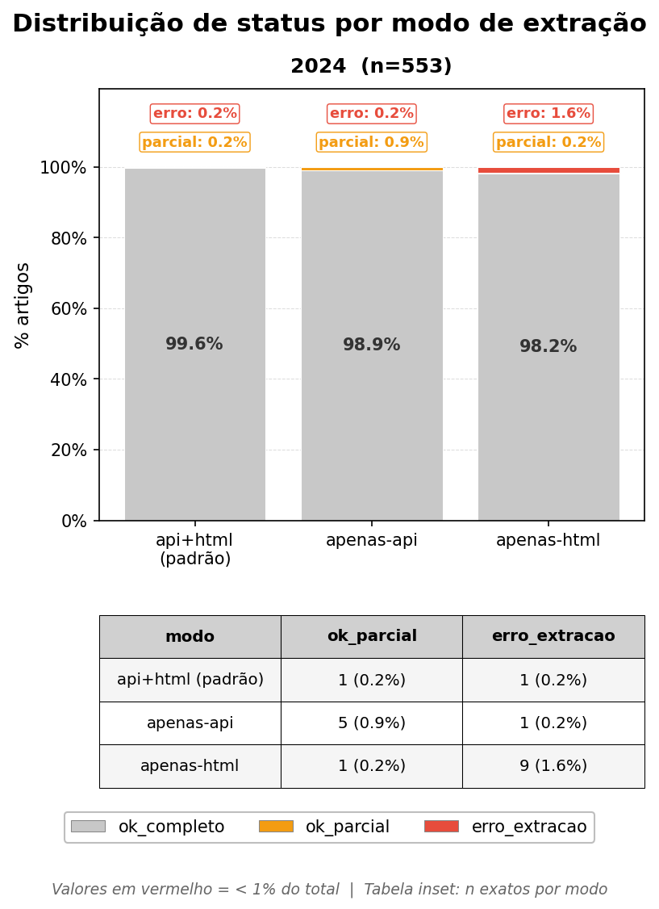
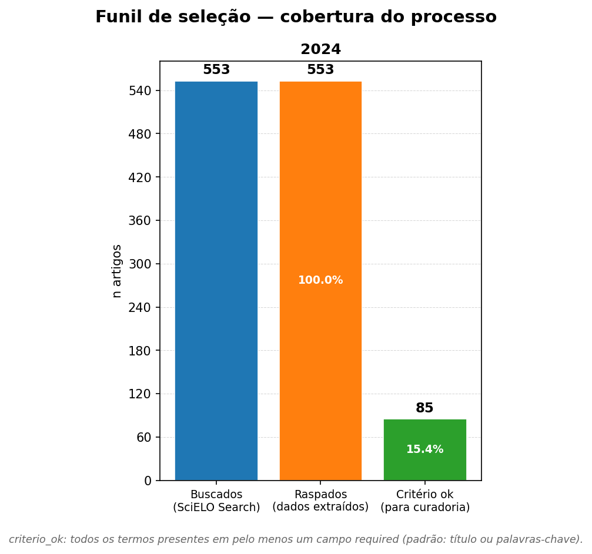
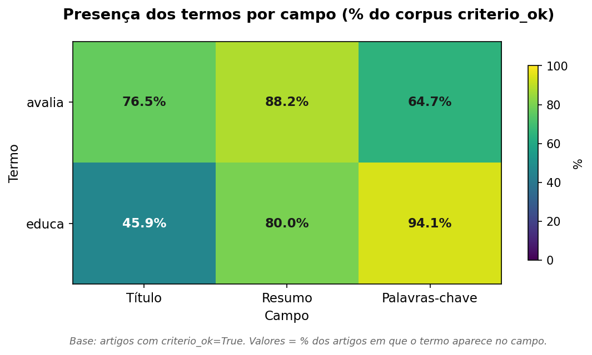
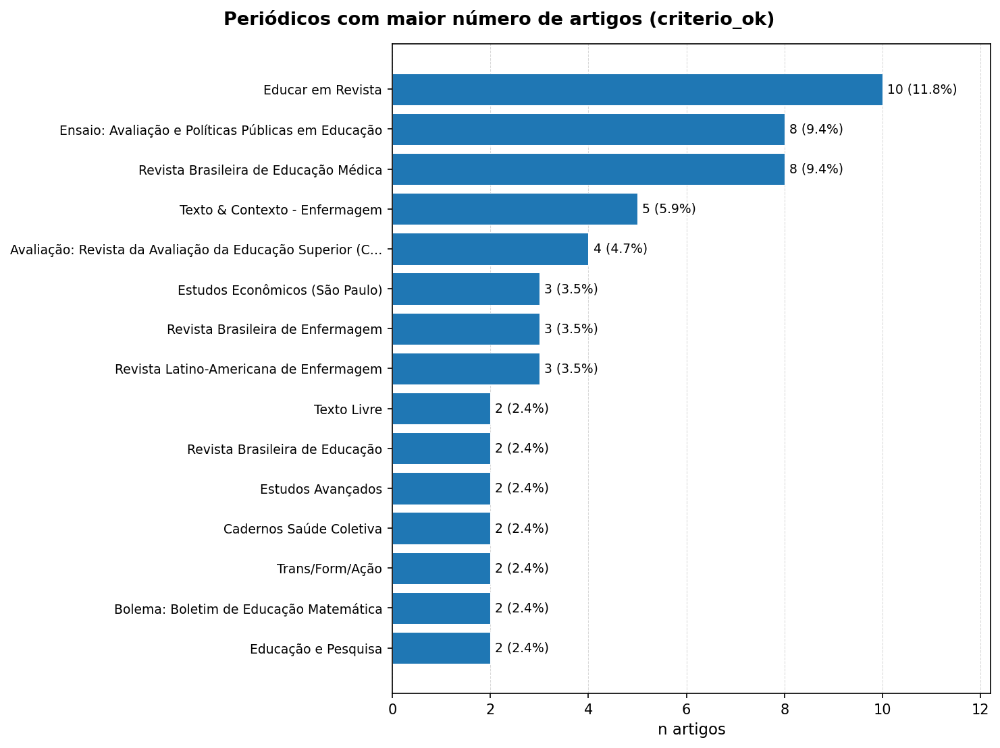
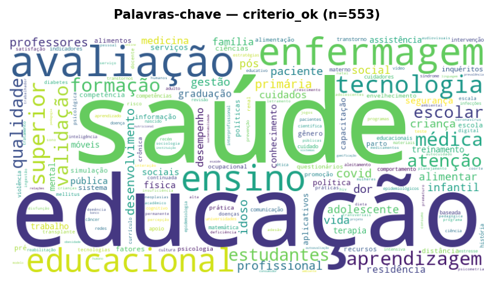
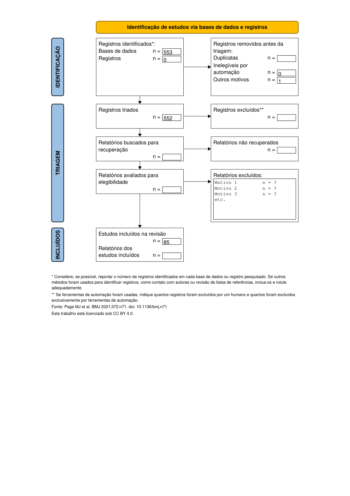

# SciELO Scraper

Extrai **título**, **resumo** e **palavras-chave em português** de artigos SciELO a partir de um CSV com PIDs. Inclui pipeline completo de busca → scraping → detecção de termos → artefatos científicos (gráficos, texto publication-ready, diagrama PRISMA).

Desenvolvido para o projeto **[e-Aval](https://eavaleducacao1.websiteseguro.com/)** — Estado da Arte da Avaliação (Fundação Cesgranrio). | 📧 eaval.bd@gmail.com | [Banco de dados](https://github.com/hexemeister/eaval)

## Como funciona

O scraper usa duas fontes de dados por ordem de prioridade:

1. **ArticleMeta REST API** — extração direta via ISIS-JSON. Rápida e confiável para a maioria dos artigos.
2. **Fallback HTML** — ativado automaticamente quando a API não retorna dados completos. Extrai meta tags (`citation_*`, `og:*`) e corpo HTML. Para artigos Ahead of Print (AoP), tenta a `og:url`.

Quando a API retorna dados parciais, o fallback preenche apenas os campos que faltam.

## Instalação

- Python 3.10+
- [uv](https://github.com/astral-sh/uv)

```bash
# Núcleo (scraping)
uv pip install requests beautifulsoup4 lxml pandas tqdm wakepy brotli

# Scripts de análise
uv pip install matplotlib matplotlib-venn upsetplot  # gráficos e Venn
uv pip install wordcloud nltk pillow                 # nuvem de palavras
uv pip install reportlab                             # diagrama PRISMA
```

> `brotli` é obrigatório — o CDN do SciELO usa compressão Brotli; sem ele o scraping falha silenciosamente.

## run_pipeline.py — Pipeline completo

Para uso regular, este é o ponto de entrada. Executa tudo em sequência: busca → 3×scraping → análise de discrepância → detecção de termos → gráficos → relatório científico → wordcloud → diagrama PRISMA.

```bash
uv run python run_pipeline.py --year 2024                     # pipeline completo para 2024
uv run python run_pipeline.py --per-year --year 2021-2025     # um destino por ano
uv run python run_pipeline.py --year 2024 --dry-run           # simula sem executar
uv run python run_pipeline.py --year 2024 --skip-scrape       # reutiliza scraping existente
uv run python run_pipeline.py --stats-report                  # relatório de todas as runs
uv run python run_pipeline.py --versions                      # versão de todos os scripts
uv run python run_pipeline.py --reset-working-tree            # remove tudo gerado (pede confirmação)
```

Gera em `runs/<ano>/`: CSV de busca, 3 pastas de scraping, análise de discrepância, gráficos de processo, relatório científico, wordclouds, PDFs PRISMA (pt + en), `pipeline_<ts>.log` e `pipeline_stats.json`.

## Workflow manual (passo a passo)

Use os scripts individuais quando precisar repetir uma etapa específica ou ajustar parâmetros.

```bash
uv run python scielo_search.py --terms avalia educa --years 2024
# → sc_<ts>.csv + sc_<ts>_params.json

uv run python scielo_scraper.py sc_<ts>.csv
# → sc_<ts>_s_<ts>_api+html/resultado.csv

uv run python terms_matcher.py --years 2024
# → terms_<ts>.csv  (booleanas por termo×campo + criterio_ok)

uv run python results_report.py --years 2024
# → results_<stem>/  (gráficos, CSVs, results_text_pt.md, results_report.json)

uv run python scielo_wordcloud.py sc_*/resultado.csv
# → wordcloud_keywords_ptbr_<ts>.png

uv run python prisma_workflow.py results_<stem>/results_report.json
# → prisma_<stem>_pt_<ts>.pdf
```

## scielo_search.py — Busca de artigos

Consulta o SciELO Search e gera um CSV pronto para o scraper.

```bash
uv run python scielo_search.py --terms avalia educa --years 2022-2025
uv run python scielo_search.py --terms avalia educa --years 2022-2025 --collection arg  # Argentina
uv run python scielo_search.py --show-params        # parâmetros da última busca
uv run python scielo_search.py --list-collections   # lista as 36 coleções disponíveis
```

| Opção | Descrição |
| ----- | --------- |
| `--terms TERMO...` | Termos de busca (truncamento automático com `$` — desative com `--no-truncate`) |
| `--years ANO` ou `ANO-ANO` | Ano ou intervalo de anos |
| `--collection COD` | Coleção SciELO (default: `scl` = Brasil) |
| `--fields CAMPO` | `ti` (título), `ab` (resumo), `ti+ab` (default) |
| `--output ARQUIVO` | Nome do CSV de saída (default: `sc_<timestamp>.csv`) |
| `--show-params [ARQ]` | Exibir parâmetros da última busca (ou de `ARQ`) |
| `--dry-run` | Mostra a query sem executar |

## scielo_scraper.py — Extração de metadados

```bash
uv run python scielo_scraper.py lista.csv            # modo padrão (api+html)
uv run python scielo_scraper.py lista.csv --only-api  # apenas API (mais rápido, sem AoPs)
uv run python scielo_scraper.py lista.csv --only-html # apenas HTML (API fora do ar)
uv run python scielo_scraper.py lista.csv --resume    # retomar execução interrompida
```

| Opção | Default | Descrição |
| ----- | ------- | --------- |
| `--output-dir DIR` | `<csv>_s_<ts>_<modo>/` | Pasta de saída |
| `--delay SEG` | `1.5` | Delay mínimo entre requests |
| `--jitter SEG` | `0.5` | Variação aleatória do delay |
| `--retries N` | `3` | Tentativas em erro transitório |
| `--timeout SEG` | `20` | Timeout HTTP |
| `--workers N` | `1` | Threads paralelas (máx: 4) |
| `--checkpoint N` | `25` | Salvar CSV a cada N artigos (0=só no final) |
| `--collection COD` | `scl` | Coleção SciELO |
| `--log-level LEVEL` | `INFO` | `DEBUG` / `INFO` / `WARNING` / `ERROR` |

O CSV de entrada precisa de uma coluna `ID` com PIDs SciELO (formato `S1982-88372022000300013`). Sufixos `-scl` ou `-oai` são removidos automaticamente.

## Comparativo de estratégias

Resultados em cinco anos de coleta (SciELO Brasil, termos: *avalia$*, *educa$*):

| Estratégia | ok_completo | Tempo médio | Quando usar |
| ---------- | ----------- | ----------- | ----------- |
| Padrão (api+html) | 99.4–99.8% | ~24–32 min | Sempre — melhor custo-benefício |
| Apenas API | 98.6–99.2% | ~24–28 min | Testes rápidos sem AoPs |
| Apenas HTML | 96.8–98.9% | ~33–71 min | API fora do ar |

Dados por ano (2021–2025):

| Ano  | n   | Estratégia        | ok_completo | ok_parcial | erro     | Tempo       | −% vs html |
| ---- | --- | ----------------- | ----------- | ---------- | -------- | ----------- | ---------- |
| 2021 | 561 | `--only-api`      | 99.1%       | 0.9%       | 0.0%     | ~25 min     | —          |
| 2021 | 561 | `--only-html`     | 96.8%       | 0.2%       | 3.0%     | ~33 min     | —          |
| 2021 | 561 | padrão (api+html) | **99.5%**   | 0.5%       | **0.0%** | **~28 min** | **−15%**   |
| 2022 | 564 | `--only-api`      | 98.6%       | 1.1%       | 0.4%     | ~25 min     | —          |
| 2022 | 564 | `--only-html`     | 98.9%       | 0.2%       | 0.9%     | ~50 min     | —          |
| 2022 | 564 | padrão (api+html) | **99.8%**   | 0.2%       | **0.0%** | **~26 min** | **−48%**   |
| 2023 | 468 | `--only-api`      | 98.9%       | 1.1%       | 0.0%     | ~24 min     | —          |
| 2023 | 468 | `--only-html`     | 98.3%       | 0.6%       | 1.1%     | ~57 min     | —          |
| 2023 | 468 | padrão (api+html) | **99.4%**   | 0.6%       | **0.0%** | **~24 min** | **−58%**   |
| 2024 | 553 | `--only-api`      | 98.9%       | 0.9%       | 0.2%     | ~27 min     | —          |
| 2024 | 553 | `--only-html`     | 98.2%       | 0.2%       | 1.6%     | ~71 min     | —          |
| 2024 | 553 | padrão (api+html) | **99.6%**   | 0.2%       | **0.2%** | **~27 min** | **−62%**   |
| 2025 | 603 | `--only-api`      | 99.2%       | 0.8%       | 0.0%     | ~28 min     | —          |
| 2025 | 603 | `--only-html`     | 98.2%       | 0.5%       | 1.3%     | ~57 min     | —          |
| 2025 | 603 | padrão (api+html) | **99.7%**   | 0.3%       | **0.0%** | **~32 min** | **−45%**   |

A coluna **−% vs html** é a economia de tempo do modo padrão em relação ao `--only-html`. A estratégia padrão usa a API para ~99% dos artigos e aciona o HTML apenas como fallback — cobertura máxima com 15%–62% menos tempo que o modo apenas-html.

## Scripts de análise

### process_charts.py — Diagnóstico do processo

Gera três gráficos PNG a partir das pastas `runs/<ano>/`: distribuição de status, fontes de extração e tempo por modo.

```bash
uv run python process_charts.py                        # todos os anos em runs/
uv run python process_charts.py --years 2022 2024      # anos específicos
uv run python process_charts.py --lang en              # em inglês
uv run python process_charts.py --lang all             # PT + EN
uv run python process_charts.py --output graficos/     # pasta de saída
```

### terms_matcher.py — Detecção de termos

Detecta termos em cada campo PT e gera colunas booleanas auditáveis (`<termo>_titulo`, `<termo>_resumo`, `<termo>_keywords`, `criterio_ok`). Roda offline.

```bash
uv run python terms_matcher.py                              # todos os anos
uv run python terms_matcher.py --years 2022 2024            # anos específicos
uv run python terms_matcher.py --terms avalia educa fisica  # termos personalizados
uv run python terms_matcher.py --required-fields titulo resumo keywords
uv run python terms_matcher.py --match-mode any             # qualquer termo satisfaz (default: all)
```

> T termos × 3 campos = 3T colunas booleanas. Com 2 termos (padrão): 6 colunas. O `criterio_ok` avalia apenas os `--required-fields` (padrão: titulo e keywords).

### results_report.py — Artefatos científicos

Gera gráficos, tabelas CSV e texto Markdown publication-ready a partir do `terms_*.csv`.

```bash
uv run python results_report.py                        # todos os anos, api+html, PT
uv run python results_report.py --years 2022 2024      # anos específicos
uv run python results_report.py --base runs/           # consolidado multi-ano → runs/results_2021-2025/
uv run python results_report.py --lang all             # PT + EN
uv run python results_report.py --artifacts funnel,trend,heatmap  # artefatos selecionados
uv run python results_report.py --show-report          # exibe JSON existente sem regerar
```

**Modo consolidado (`--base runs/`):** agrega múltiplos anos num único conjunto — funil por ano lado a lado, trend de evolução e ranking de periódicos sobre o corpus total. Com 5 anos (2021–2025, n=370), a *Revista Brasileira de Educação Médica* domina com 50 artigos (13,5%), presença que não se destaca em nenhum ano isolado. A pasta de saída é `runs/results_<ano_min>-<ano_max>/`.

### scielo_wordcloud.py — Nuvem de palavras

```bash
uv run python scielo_wordcloud.py                             # auto-descobre resultado.csv
uv run python scielo_wordcloud.py resultado.csv --field abstract
uv run python scielo_wordcloud.py resultado.csv --corpus all  # todos os artigos, não só criterio_ok
uv run python scielo_wordcloud.py resultado.csv --mask forma.png
uv run python scielo_wordcloud.py resultado.csv --colormap plasma
```

Gera `wordcloud_{campo}_{lang}_{ts}.png` por campo e `wordcloud_stats_{ts}.json`.

### prisma_workflow.py — Diagrama PRISMA 2020

Gera PDF A4 preenchível. A fase de Identificação é auto-preenchida a partir do `results_report.json`; Triagem e Inclusão ficam como campos AcroForm para curadoria humana.

```bash
uv run python prisma_workflow.py                              # auto-descobre o JSON
uv run python prisma_workflow.py results_report.json          # JSON explícito
uv run python prisma_workflow.py results_report.json --included 80 --excluded-screening 523
uv run python prisma_workflow.py results_report.json -i       # modo interativo
uv run python prisma_workflow.py results_report.json --lang en
uv run python prisma_workflow.py --export-template            # exporta layout para customização
```

> O layout PRISMA está embutido no script. `assets/PRISMAdiagram.json`, se presente, sobrepõe o padrão.

## Exemplos de artefatos gerados

> Gerados com `run_pipeline.py --per-year --year 2021-2025`, termos `avalia educa`, coleção SciELO Brasil.

### Diagnóstico do processo (`process_charts.py`)

Compara as três estratégias por ano. O modo `api+html` domina com >99% de extração completa; o `--only-html` chegou a 71 min em 2024 com até 3% de erros.



### Funil de seleção (`results_report.py`)

553 buscados → 553 scrapeados (100%) → 85 criterio_ok (15,4%). Ponto de partida para o PRISMA.



### Distribuição de termos por campo (`results_report.py`)

*educa* concentra 94,1% nas palavras-chave; *avalia* distribui-se mais entre título (76,5%) e resumo (88,2%).



### Periódicos com maior representação (`results_report.py`)

Em 2024: *Educar em Revista* (11,8%), *Ensaio* (9,4%) e *RBEM* (9,4%) concentraram 30,6% do corpus. Com 5 anos agregados (n=370), a *Revista Brasileira de Educação Médica* sobe para 1º lugar com 50 artigos (13,5%).



### Nuvem de palavras (`scielo_wordcloud.py`)

Gerada a partir das palavras-chave do corpus `criterio_ok`. Domínio de *saúde*, *educação* e *enfermagem*.



### Diagrama PRISMA 2020 (`prisma_workflow.py`)

Fase de Identificação auto-preenchida (n=553, triagem=552, incluídos sugeridos=85). Triagem e Inclusão ficam editáveis.



### Texto publication-ready (`results_report.py`)

O `results_text_pt.md` entrega Metodologia, Resultados, Limitações e descrição de figuras prontas para submissão. Exemplo (2024):

> *"A busca bibliográfica, conduzida em 5 de maio de 2026, foi realizada na plataforma SciELO Brasil [...] identificando 85 artigos (15,4%) como potencialmente relevantes para curadoria humana."*

## Conceitos e terminologia

| Termo | Definição |
| ----- | --------- |
| **PID** | Identificador único SciELO (23 caracteres). Formato: `S` + ISSN + ano + volume/fascículo + sequência. Ex: `S1982-88372022000300013`. |
| **AoP** | Ahead of Print — publicado online antes de receber fascículo definitivo. Identificado por `005` nas posições 14–16 do PID. Não indexado na API; extraído apenas via HTML. |
| **Coleção** | Conjunto de periódicos de um país. Código de 3 letras: `scl` = Brasil, `arg` = Argentina, `prt` = Portugal. |
| **Truncamento** | `$` ao final do termo casa com variações morfológicas: `avalia$` → "avaliação", "avaliativo". Ativo por padrão no `scielo_search.py`. |
| **criterio_ok** | `True` se todos os termos aparecerem em pelo menos um dos `--required-fields` (padrão: titulo ou keywords). |
| **fallback HTML** | Estratégia secundária: quando a API não retorna um campo, o scraper extrai via meta tags ou corpo HTML da página. |
